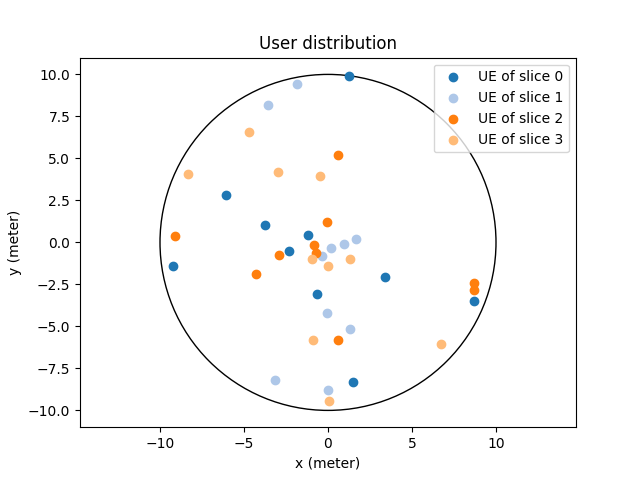
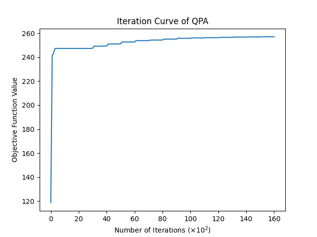

# The DQCO Framework for UAWN Slicing - Simulation Code

[](LICENSE)
[](https://www.python.org/)

This repository contains the simulation code for the paper:  
**"Fast Slicing for UAV-Aided Wireless Networks: A
Quasiconvex Decomposition Framework"**  
*(Submitted to IEEE INFOCOM, 2026)*


## 🚀 Quick Start
### Installation
```bash
pip install -e .
```

### Run Simulation

To run the simulation, just run the following cmd:
```bash
python algorithms/main_algorithms/run_simulations.py
```
This will perform the following tasks:
#### 1). Create a simulated UAWN
A default UAV-aided Wireless Network (UAWN) is created for simulation, which contains 4 network slices, each of which has 10 UEs.



#### 2). Solve the UAV Slicing Problem (USP) by using the DQCO framework

Solve the problem by using quasi-subgradient projection algorithm (QPA), where in the projection
is performed by using the Proj-KKT algorithm.

Note that the ORA is not performed in run_simulations.

To see the realization of Algorithm 1~3, please refer to the following codes.

```bash
├── algorithms
├── main_algorithms
├── ├── run_simulations.py              # QPA algorithm   
│   ├── projection.py                   # Proj-KKT algorithm
│   │   ├── rounding/
│   │       └── rounding_algorithms.py  # ORA rounding
```

#### 3). Plot the Convergence Curve
Finally, the script will show the best function value, as well as the convergence curve of QPA.




## 🤝 Contributing
Pull requests are welcome. For major changes, please open an issue first.
